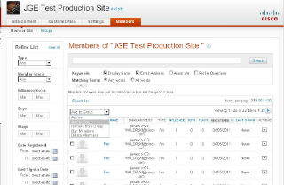

## Stanford VPTL: HST project (8/2016 - 2/2017)

At Stanford VPTL group my responsibility was to architect and build Front End for the educational web application that allows professors to create and manage exams. The application is heavily focused on high level user interactions with web interface.
It allows to:
* Authenticate user with roles
* Create new exams 
* Load and edit exisisting exams
* Perform searches with filtering and sorting
* Upload and Remove media files
* Smart auto scroll based on states
* Auto save documents in Edit mode
* Validate data
* Supports Security
* Built with Performance in mind
* Supports Responsive Design
* Supports Assesibility

#### Tech Stack:
* Angular 1.5 with Require.js
* Angular Bootstrap UI
* HTML5
* CSS2
* Java
* SQL DB

## Teradata: App Center 2.0 (8/2016 - 2/2017)

The project involved building the next version of AppCenter dashboard with up-to-date UI and UX, better performance and richer features. Integrated Login Auth, LDAP Settings, JSON validation, Stepper and other modules.

#### Tech Stack: 
* Angular 2.0
* Angular Material Design
* Angular-Formly: Material Templates
* RESTful API communications
* Java
* Node.js
* Docker Containers

#### Tech Stack:

This portal was built to allow CISCO Cloud users to have a consistent flow and seamless experience of interacting with various external CISCO systems.

The project involved a complete UI Architecture of the large scale application, integration with external and internal system components, RESTful API, security, authentication, SSO support, permissions, cross system communication, performance optimization, responsive design and more.
